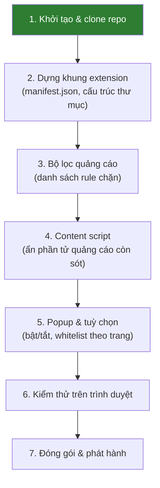

# Banana Ads Block

Dự án extension chặn quảng cáo cho trình duyệt, do **Lưu Khánh Vinh** thực hiện.

## Trạng thái

Dự án mới khởi tạo. Hiện tại repo chỉ mới được tạo và kết nối — chưa có mã nguồn.

## Sơ đồ các bước thực hiện



## Tiến độ

- [x] **Bước 1 — Khởi tạo & clone repo**
- [ ] **Bước 2 — Dựng khung extension**: tạo `manifest.json` (Manifest V3) và cấu trúc thư mục cơ bản
- [ ] **Bước 3 — Bộ lọc quảng cáo**: khai báo rule chặn request qua `declarativeNetRequest`
- [ ] **Bước 4 — Content script**: ẩn banner, popup quảng cáo không chặn được ở tầng mạng
- [ ] **Bước 5 — Popup & tuỳ chọn**: giao diện bật/tắt, danh sách trang loại trừ, đếm số quảng cáo đã chặn
- [ ] **Bước 6 — Kiểm thử**: chạy thử ở chế độ developer mode, kiểm tra trên các trang thực tế
- [ ] **Bước 7 — Đóng gói & phát hành**: build file `.zip`, chuẩn bị mô tả và ảnh chụp màn hình

## Bắt đầu

```bash
git clone https://github.com/luukhanhvinh1214/banana-ads-block.git
cd banana-ads-block
```

Các bước cài đặt và chạy thử sẽ được bổ sung sau khi hoàn thành bước 2.
